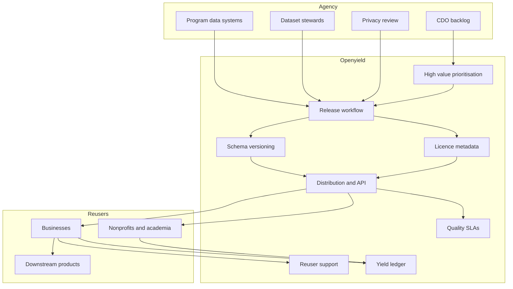

# Openyield

**Source:** `ai-in-gov/Accenture-Open-Data-Executive-Summary/`
**Domain:** `ai-gov`
**One-liner:** An open-data product operations system that helps agencies publish stable, licensed, high-value datasets — and measure the downstream business and civic yield those releases actually create.
**Wedge:** Federal and large state open-data programs that can list portals but cannot prioritise high-value datasets, sustain schema quality after launch, or evidence economic reuse to OMB/legislatures — starting with health, weather/geo, and demographic flagship series already proven in private-sector reuse.
**Positioning:** Open-data supply-chain software for government, not another CKAN skin. The Accenture / Center for Open Data Enterprise brief shows businesses already build products on government data (CVS myhealthfinder, Starbucks Atlas, Best Buy personas, Kellogg weather-sales models); Openyield closes the agency-side gap — prioritise, publish to standard, licence clearly, support re-users, prevent re-identification, and account for yield.

## Market research synthesis

### Thesis from source

The executive summary reframes open government data as twenty-first-century business intelligence infrastructure. It traces “business intelligence” to Henry Furnese’s seventeenth-century practice of structuring public and private information, then shows modern firms combining government releases with proprietary data to transform strategy. Named proofs: CVS Health’s myhealthfinder using HHS data for personalised preventive-care recommendations fulfilled at MinuteClinic/Pharmacy; Starbucks’ Atlas platform combining government demographics, weather, and proprietary sales to time Frappuccino promotions and place mobile discounts where smartphone penetration is high; Best Buy’s persona segmentation (Barry, Jill, Buzz, Ray) mixing government demographics with sales data to reinvent store and online experience.

The July 2017 Roundtable on Open Data for Economic Growth (Center for Open Data Enterprise + White House OMB), with ~80 participants from federal government, business, nonprofits, and academia, confirmed that businesses depend on government data to guide investment, develop products, and foster innovation. Kellogg’s Rick Davis describes a four-step method any firm can use: (1) formulate question and hypothesis; (2) identify relevant government and proprietary datasets; (3) conduct analytics; (4) apply findings to strategy — e.g., cereal sales drop after three consecutive days below 20°F, except Fridays when payday outweighs weather, leading Kellogg to shift digital coupon timing. Looking forward, the brief argues emerging tech (including ML — Walmart combining government data with routing optimisation) will increase demand for freer, easier-to-use releases, and that agencies should commit to better *internal* analysis of high-value datasets so government-generated insights further spark private products.

The product insight: agencies are scored on portal counts, not on whether datasets remain schema-stable, correctly licensed, privacy-safe under linkage, supported for re-users, or tied to measurable downstream value. Openyield is the operating system for that supply and yield loop.

### Buyer & economic model

- **Primary buyer:** Chief Data Officer / open-data program executive at a federal department or state, often with OMB/budget performance as the economic buyer for “high-value dataset” commitments.
- **Users:** dataset stewards in program offices, privacy/disclosure review, geospatial and statistical standards leads, developer-relations / re-user support, economists measuring reuse, procurement (data sharing agreements).
- **Budget owner / value metric:** open-data and digital-government program budgets. Value metrics: high-value dataset SLA attainment (freshness, schema break rate), re-user active projects, attributed economic/civic outcomes, privacy incidents at zero, time-to-licence clarity.
- **Competing status quo:** static open-data portals with irregular dumps, PDF “data,” unclear licences, one-off hackathon extracts that rot, and no feedback loop from re-users to stewards — while private firms quietly build billions in value on the reliable series.

### Domain constraints

- **Regulatory / trust / safety:** publication standards and open licences; statistical disclosure control and re-identification risk from linkage; privacy law when microdata is involved; sustaining publication as a standing obligation, not a project; FOI vs proactive release interplay; national-security and law-enforcement carve-outs.
- **Data sensitivity:** health, precise location, small-cell demographics, and any dataset linkable to proprietary customer data on the re-user side create residual risk even when “anonymised.”
- **Change-management realities:** program offices own data quality but open-data teams own the portal; without steward SLAs and yield reporting, publication dies after the press release; Roundtable-style co-design with business users is required to pick the right series.

## Business requirements

- BR-1: Every published dataset must have a named steward, update cadence, schema version, and open licence machine-readable at the distribution level.
- BR-2: High-value dataset designation must follow documented prioritisation (re-user demand, unique government holding, economic/civic potential) with Roundtable-style stakeholder input on record.
- BR-3: Schema breaks require advance notice and a compatibility window; silent breaking changes are a service failure.
- BR-4: Privacy review must assess linkage and re-identification risk before release and on material schema or grain changes.
- BR-5: Re-user support must offer documented APIs/downloads, sample queries, and a support channel with published response standards.
- BR-6: The platform must capture re-user projects and attested outcomes (product launched, cost saved, insight applied) so yield is evidenced rather than asserted.
- BR-7: Agencies should be able to publish government-generated analytical insights (not only raw tables) when internal analysis of high-value series produces reusable findings — matching the brief’s forward-looking recommendation.
- BR-8: Licence and attribution requirements must be enforceable in metadata and visible before download.
- BR-9: Dataset retirement or suppression must leave a tombstone with reason and successor link, preserving provenance for downstream models.
- BR-10: Quality metrics (completeness, timeliness, schema stability) must be public for high-value series.
- BR-11: Commercial SaaS terms for Openyield must not claim ownership of agency data or lock distributions behind proprietary formats.
- BR-12: Security and access tiers must support fully open, registered, and restricted research access without conflating them in one bucket.

## User stories

Canonical user stories live in sibling [USER_STORIES.md](USER_STORIES.md).

## System design

### Overview

Openyield manages the lifecycle of open datasets: prioritise high-value candidates with stakeholder input, run privacy and licence gates, publish versioned distributions, monitor quality SLAs, support re-users, collect project and yield attestations, and optionally publish agency-produced insight products derived from high-value series. It integrates with existing portals and data lakes but owns stewardship workflow and yield accounting.

### Actors & boundaries

- **Actors:** stewards, CDO/program, privacy, re-users (firms, nonprofits, academia), API consumers, OMB/performance reviewers.
- **Trust boundary:** pre-release microdata stays inside agency; public distributions are intentionally outside; restricted research enclaves are a third zone; re-user proprietary data never enters Openyield.
- **Human-in-the-loop points:** high-value designation; privacy approval; licence selection; suppression; yield attestation verification when claimed outcomes are material.

### Core capabilities

1. **High-value prioritisation and backlog** — stakeholder input and scoring.
2. **Stewardship and release workflow** — checklist, cadence, tombstones.
3. **Schema versioning and change notice** — compatibility windows.
4. **Privacy and linkage-risk review** — gate before publish/grain change.
5. **Licence and attribution metadata** — machine-readable at distribution.
6. **Distribution and API publishing** — open/registered/restricted tiers.
7. **Re-user support and tickets** — developer relations.
8. **Project registry and yield attestations** — economic/civic outcome capture.
9. **Quality SLA monitoring** — timeliness, completeness, break rate.
10. **Insight product publishing** — agency-generated analyses on high-value series.

### Conceptual data

- **Primary entities:** Agency, Dataset, DatasetVersion, Distribution, Licence, Steward, PriorityScore, PrivacyReview, SchemaDiff, ReuserOrg, ReuserProject, SupportTicket, YieldAttestation, QualityMetric, InsightProduct, AccessTier, SuppressionEvent.
- **Critical events:** dataset prioritised, privacy approved/rejected, version published, schema break noticed, ticket opened, project registered, yield attested, quality SLA breached, suppression executed.
- **Retention / audit needs:** privacy reviews and suppressions retained for oversight; yield attestations retained for budget justification; schema history retained for re-user provenance indefinitely at metadata level.

### Integrations (conceptual)

- **Systems of record:** enterprise data warehouses/lakes, statistical production systems, existing open-data portals, identity for registered/restricted tiers.
- **Upstream signals:** program office source extracts, Roundtable/stakeholder demand votes, privacy risk tools, national metadata standards (DCAT-class).
- **Downstream actions:** portal publications, API gateways, re-user notifications, OMB performance exports, press/insight pages.

### High-level architecture

### Success metrics

- **Leading:** % high-value datasets with steward + licence + cadence; schema-break notice lead time; privacy review cycle time; active re-user projects; support SLA attainment; quality SLA breaches.
- **Lagging:** attested yield outcomes per year (products, operational savings, insight applications); sustained freshness at 12+ months post-launch; zero re-identification incidents; re-user NPS; budget renewals tied to yield evidence.

## OpenAPI skeleton

Canonical HTTP surface lives in sibling [openapi.yaml](openapi.yaml). Summary:

- **Base path:** `/v1/...`
- **Auth:** `X-API-Key` for portal/pipeline integration and re-user APIs; Bearer JWT for stewards and CDO operators.
- **Resource groups:** Datasets, Releases, Privacy, Reusers, Yield, Quality, Insights.
