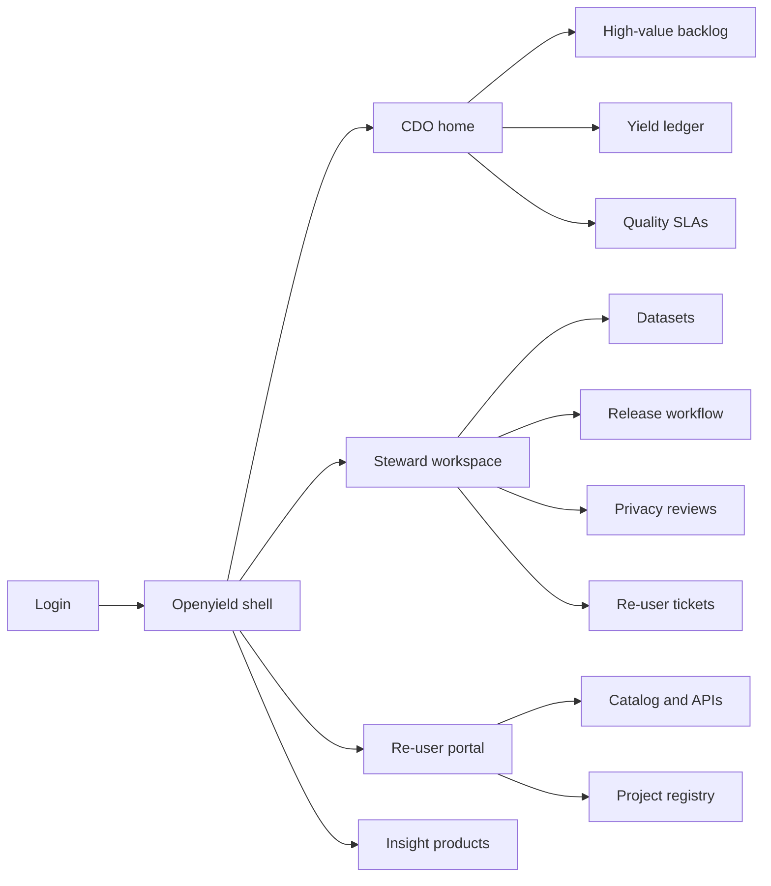
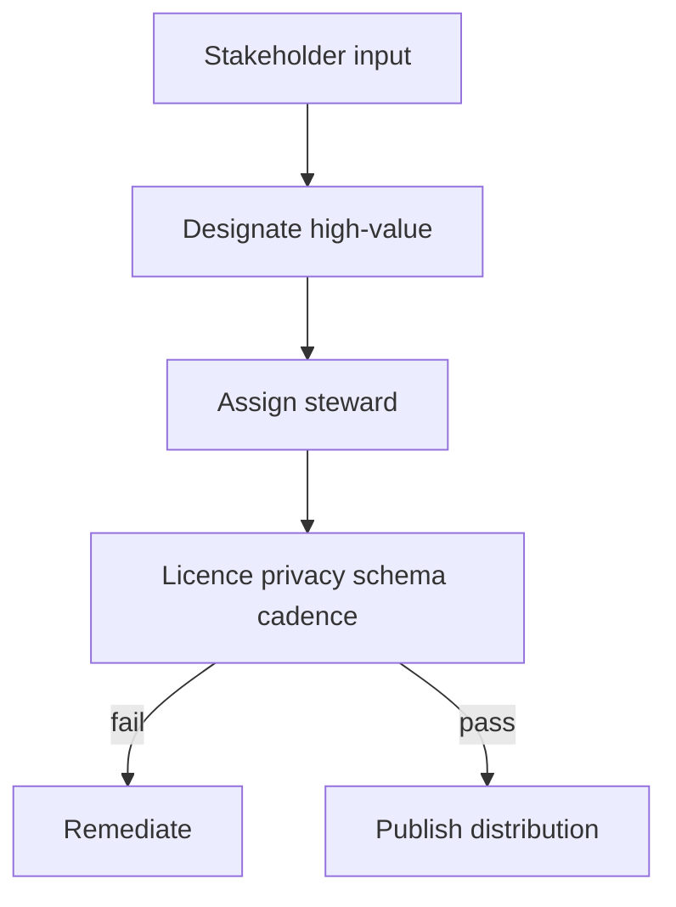

# Openyield — Web app

**Product:** [PRODUCT.md](./PRODUCT.md)
**Primary surface:** Agency open-data product operations console (CDO, stewards, privacy)
**Secondary surfaces:** Re-user developer portal (projects, downloads, support); public quality/yield scorecard
**Design thesis:** Openyield is a supply-chain control tower for government data products — not another portal skin that counts CSVs. The UI metaphor is a shipping manifest and yield ledger: every high-value series has a steward, cadence, schema version, and licence before it leaves the dock; silent schema breaks are treated as service failures; downstream business and civic outcomes are attested back into a yield ledger the CDO can take to OMB. Visual language is chart-room white-cyan on deep ocean-ink ground — cartographic precision without tourism maps — with licence and privacy gates as unmistakable dock stamps. The Openyield wordmark sits as a quiet mint-of-provenance on every release and yield screen.

## UX research synthesis

### Category peers (best-in-class)

- **data.gov / European Data Portal (data.europa.eu):** Dataset discovery with DCAT metadata and licence visibility. Steal: machine-readable licence before download; reject portal-count vanity as the programme home.
- **Socrata / Tyler Data & Insights (steward workflows):** Steward publishing checklists and quality flags. Steal: release workflow density; reject “publish then forget” with no schema-break notices.
- **AWS Open Data / Registry of Open Data on AWS:** Stable identifiers, clear terms, re-user examples. Steal: re-user project visibility and distribution clarity; reject lock-in behind proprietary query-only formats (BR-11).
- **UK ONS / Census disclosure-control tooling (conceptual UX):** Pre-release privacy gates and suppression with provenance. Steal: linkage-risk review and tombstones; reject burying privacy in a PDF checklist outside the release path.

### Patterns to adopt / reject

- **Adopt:** High-value backlog with stakeholder votes; steward + licence + cadence as release blockers; schema diff with compatibility window; privacy review on grain changes; re-user tickets tied to datasets; yield attestations as first-class nav; public quality SLAs; open / registered / restricted tiers without conflation; insight products as publishable siblings of tables.
- **Reject:** Portal catalogue as the only home; PDF-as-data; unclear licences after download; hackathon one-offs without cadence; composite “openness score” hiding broken series; purple AI “insight bots” that invent statistics.

### Trust, density, and workflow constraints from PRODUCT.md

Program offices own quality; open-data teams own the portal — the console must bind both via steward SLAs (BR-1, BR-10). Re-identification risk rises when grain changes or linkage is possible (BR-4): privacy gates block publish. Yield must be evidenced, not asserted (BR-6). Agency data ownership stays with the agency; Openyield never claims it (BR-11). Restricted microdata must never look like “just another open tile” (BR-12).

## Information architecture

### Nav model

### Roles → default home

| Role | Default home | Why |
|------|--------------|-----|
| CDO / open-data program lead | CDO home — backlog + yield | Fund series that unlock reuse (BR-2, BR-6) |
| Dataset steward | Steward release queue | Checklist before publish (BR-1) |
| Privacy officer | Privacy reviews | Linkage risk before release (BR-4) |
| Re-user (business / civic) | Catalog + project registry | Stable schemas and licence clarity (BR-3, BR-8) |
| Developer relations | Support tickets | Response standards (BR-5) |
| Economist / performance | Yield ledger | OMB defence (BR-6) |
| Platform admin | Access tiers + suppressions | Open vs registered vs restricted (BR-12) |

### Cross-links to OpenAPI resources

| Nav area | OpenAPI tags / resources |
|----------|---------------------------|
| Datasets / stewards | Datasets |
| Release workflow / versions | Releases |
| Linkage-risk gates | Privacy |
| Orgs, projects, tickets | Reusers |
| Attested outcomes | Yield |
| SLA metrics | Quality |
| Agency-generated analyses | Insights |

## Screen inventory

### CDO home

- **Purpose:** Answer “which high-value series are failing SLA, and what yield can we show this quarter?”
- **Entry:** CDO login default.
- **Layout regions:** Brand + agency switcher; high-value SLA strip (freshness, schema breaks, licence coverage); yield attestations summary; backlog items awaiting designation; privacy/suppression alerts.
- **Primary actions:** Open backlog; export quarterly yield report; drill into breached series.
- **Empty / loading / error:** Empty programme = guided “import flagship health/weather/geo candidates.”
- **BR / story ties:** BR-2, BR-6, BR-10.

### High-value backlog

- **Purpose:** Rank candidates with documented prioritisation and Roundtable-style stakeholder input on record.
- **Entry:** CDO nav → Backlog.
- **Layout regions:** Scored list (re-user demand, unique holding, economic/civic potential); stakeholder vote panel; designation decision with rationale; link to steward assignment.
- **Primary actions:** Record stakeholder input; designate high-value; reject vanity CSV with reason.
- **Empty / loading / error:** No votes = cannot designate without documented input exception path.
- **BR / story ties:** BR-2.

### Dataset steward workspace

- **Purpose:** Own steward, cadence, schema version, and licence for each series.
- **Entry:** Steward default.
- **Layout regions:** My datasets table; cadence calendar; missing licence/steward blockers; ticket count per dataset.
- **Primary actions:** Edit stewardship; open release checklist; jump to tickets.
- **Empty / loading / error:** Unassigned steward = coral on dataset row.
- **BR / story ties:** BR-1, BR-5.

### Release workflow

- **Purpose:** Checklist covering licence, privacy, schema diff, and cadence before distribution goes live.
- **Entry:** From dataset → Release; scheduled cadence.
- **Layout regions:** Checklist stages; schema diff viewer; compatibility window setter; licence picker (machine-readable); access tier selector; publish / rollback.
- **Primary actions:** Pass checklist; schedule notice; publish version; notify known re-users on rollback.
- **Empty / loading / error:** Silent break attempt without notice = blocked (BR-3); privacy pending = cannot publish.
- **BR / story ties:** BR-1, BR-3, BR-8.

### Privacy and linkage-risk review

- **Purpose:** Assess re-identification risk before release and on grain/schema changes.
- **Entry:** Privacy queue; release gate.
- **Layout regions:** Review cases; grain and linkage notes; approve/reject; emergency suppression with tombstone preview.
- **Primary actions:** Approve; reject with remediation; suppress distribution.
- **Empty / loading / error:** Material grain change without new review = auto-open case.
- **BR / story ties:** BR-4, BR-9.

### Schema change notice board

- **Purpose:** Advance notice and compatibility window for breaking changes.
- **Entry:** From release; re-user notifications.
- **Layout regions:** Upcoming breaks; window dates; migration notes; subscriber list status.
- **Primary actions:** Publish notice; extend window; mark compatible shim available.
- **Empty / loading / error:** Empty = “no breaking changes scheduled.”
- **BR / story ties:** BR-3.

### Re-user catalog and developer portal

- **Purpose:** Discover distributions with licence visible before download; APIs, samples, support channel.
- **Entry:** Public/registered re-user login.
- **Layout regions:** Search; dataset page (licence first, quality SLA, schema version); sample queries; download/API keys by tier; support CTA.
- **Primary actions:** Download; register project; open ticket; accept attribution terms.
- **Empty / loading / error:** Restricted tier datasets show request path, not open download buttons.
- **BR / story ties:** BR-5, BR-8, BR-12.
- **Mobile notes:** Catalog browse OK; API key management desktop-preferred.

### Project registry and yield ledger

- **Purpose:** Capture re-user projects and attested outcomes so yield is evidenced.
- **Entry:** Re-user projects; CDO Yield nav.
- **Layout regions:** Project cards (product launched, cost saved, insight applied); attestation verification state; quarterly rollup for OMB export.
- **Primary actions:** Register project; submit attestation; verify (CDO); export yield report.
- **Empty / loading / error:** Empty yield = prompt stewards to invite flagship re-users, not invent numbers.
- **BR / story ties:** BR-6.

### Quality SLA monitor

- **Purpose:** Public completeness, timeliness, and schema stability for high-value series.
- **Entry:** Quality nav; public scorecard.
- **Layout regions:** Per-series metrics; breach list; steward ownership; public toggle.
- **Primary actions:** Acknowledge breach; open remediation; publish public metrics.
- **Empty / loading / error:** Missing cadence = automatic breach.
- **BR / story ties:** BR-10.

### Insight products

- **Purpose:** Publish agency-generated analytical insights on high-value series, not only raw tables.
- **Entry:** Insights nav.
- **Layout regions:** Insight list linked to source series; methodology; licence; version.
- **Primary actions:** Publish insight; cite source versions; retire with tombstone.
- **Empty / loading / error:** Insight without source series link = blocked.
- **BR / story ties:** BR-7.

### Suppression and tombstones

- **Purpose:** Retire/suppress with reason and successor link; preserve provenance.
- **Entry:** Privacy emergency; admin.
- **Layout regions:** Active suppressions; tombstone page preview; re-user notification status.
- **Primary actions:** Suppress; set successor; notify; restore if cleared.
- **Empty / loading / error:** Suppression without reason = blocked.
- **BR / story ties:** BR-9.

## Key flows

1. **Designate and publish high-value series** — stakeholder input → designate → assign steward → privacy + licence checklist → publish version; failure: missing licence or privacy blocks dock (BR-1, BR-2, BR-4).

2. **Schema break with notice** — detect breaking diff → set compatibility window → notify re-users → publish; failure: silent break treated as service failure (BR-3).

3. **Re-user yield loop** — download with licence → register project → attest outcome → CDO verifies → yield report (BR-6, BR-8).

4. **Emergency suppression** — privacy trigger → suppress distribution → tombstone + successor → notify known re-users (BR-9).

5. **Tiered access** — request restricted research access → approve → keyed distribution; open tier never shows restricted files (BR-12).

## Design system

### Tokens (CSS variables)

- `--color-ink: #E8F1F6` — primary text
- `--color-ocean-950: #0B1520` — app ground
- `--color-ocean-900: #122030` — panels
- `--color-ocean-700: #2A4158` — rules
- `--color-cyan: #3DB8C5` — publish / SLA healthy
- `--color-amber: #E6A23C` — schema notice / provisional
- `--color-coral: #E85D4C` — privacy block / SLA breach
- `--color-steel: #8AA4B8` — secondary labels
- `--color-brand: #9FD4DE` — Openyield wordmark
- `--font-display: "Public Sans", sans-serif` — civic-tech clarity (not Inter-as-default hero; distinctive cuts for titles)
- `--font-body: "Source Sans 3", sans-serif`
- `--font-mono: "IBM Plex Mono", monospace` — schema versions, distribution ids
- `--space-1`…`--space-8`: 4px scale
- `--radius-sm: 4px`; `--radius-md: 8px`
- `--motion-publish: 200ms ease-out` — dock stamp
- `--motion-breach: 240ms ease-in-out` — SLA pulse
- `--motion-notice: 180ms linear` — schema notice appear
- Atmosphere: faint lat/long grid and soft depth gradient (chart room), not stock city skylines or purple nebulae.

### Typography & brand

- Display for dataset titles and yield numerals; mono for versions and licence SPDX-like ids.
- Brand on release and yield views; re-user portal shows brand + licence strip before download CTAs.
- Marketing/login: brand hero; headline (“Publish for yield, not portal counts.”); one CTA.

### Do / don’t

- **Do:** Licence before download; schema notices with windows; yield as ledger; separate access tiers visually; tombstones on suppression.
- **Don’t:** Purple AI glow; vanity dataset count hero; PDF dumps as success; editable yield attestations after verification; card grids of unrelated civic KPIs.

### Accessibility & domain trust cues

- AA+ contrast; breach/privacy states use text + icon.
- Live regions for SLA breaches and suppression events.
- Focus order: backlog → steward → privacy → release → yield.
- Public quality pages include methodology footnotes.

## Component patterns

- **ReleaseChecklist** — licence, privacy, schema, cadence gates.
- **SchemaDiffNotice** — break + compatibility window.
- **LicenceBeforeDownload** — blocking disclosure strip.
- **YieldAttestationRow** — project outcome with verification state.
- **QualitySlaStrip** — freshness, completeness, break rate.
- **AccessTierBadge** — open / registered / restricted.
- **TombstonePage** — retired distribution with successor.
- **StakeholderVotePanel** — Roundtable-style input on backlog.
- **InsightProductCard** — agency analysis linked to source series.

## Out of scope for v1 web

- Full enterprise data-lake replacement; national FOIA case management; re-user proprietary analytics workspace inside the agency boundary; marketplace billing for data (open-by-default); mobile-native steward publishing apps.
